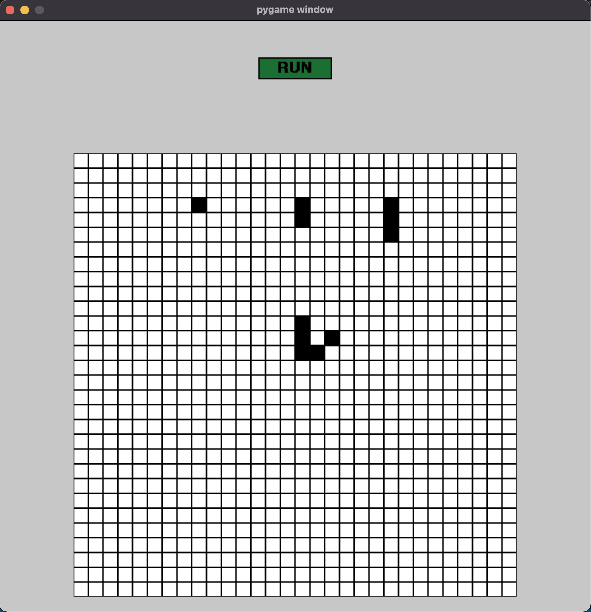
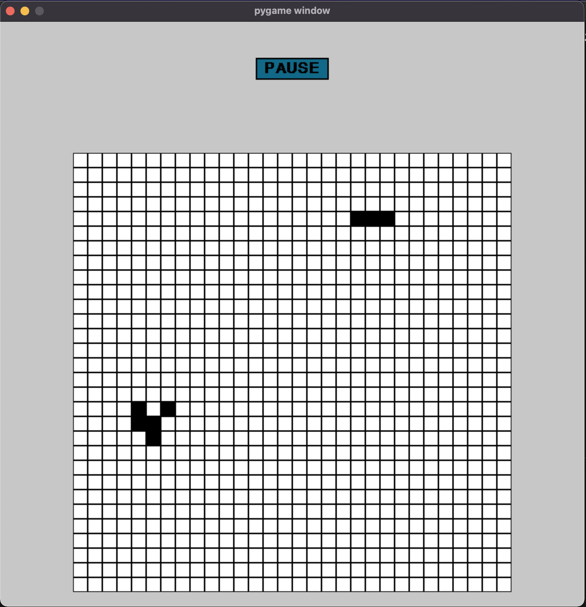

# Conway's Game of Life Using Python

## Game Description

According to Wikipedia's article: "The Game of Life, also known simply as Life, is a cellular automaton devised by the British mathematician John Horton Conway in 1970."

The board is made up of an a x b grid of cells, where each cell has an initial state: live (represented by a  '1') or dead (represented by a  '0'). Each cell interacts with its eight neighbors (horizontal, vertical, diagonal) using the following four rules (taken from the above Wikipedia article):

## Rules of the Game

      1. Any live cell with fewer than two live neighbors dies as if caused by under-population.

      2. Any live cell with two or three live neighbors lives on to the next generation.

      3. Any live cell with more than three live neighbors dies, as if by over-population.

      4. Any dead cell with exactly three live neighbors becomes a live cell, as if by reproduction.
      
The next state is created by applying the above rules simultaneously to every cell in the current state, where births and deaths occur simultaneously. Given the current state of the a x b grid board, return the next state.

 
Example :

      Input: board = [[0,0,0,1],[1,0,1,1],[0,1,0,1],[0,1,0,1],[0,0,0,0]]

      Output: board = [[0,0,1,1],[0,0,1,1],[1,1,1,1],[0,0,1,1],[0,0,0,0]]

## Installation

1. Clone the repository and navigate to `Conways-Game-of-Life-Using-Python` directory.

       git clone https://github.com/abhishek0795/Conways-Game-of-Life-Using-Python.git

2. Install the required python module.
      
       pip3 install pygame

## Usage

Execute the python code using the below command

       python3 main.py

## Sample outputs

### Step 1 :

       Run the game after clicking the button on grid boxes by making different patterns.

### Step 2:

       Click on Pause button if you want to hold the game in between.

### Step 3:

       Click on Resume button if you want to again start the game.

### Step 4:

       After clicked on Reset button the game will play from the beginning.

